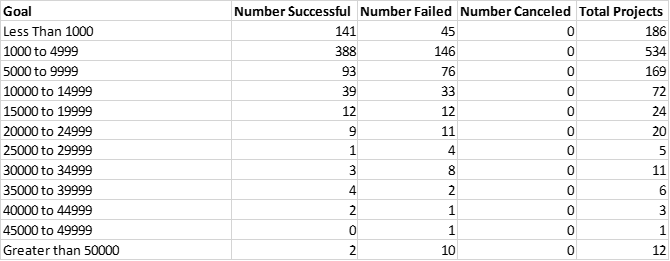
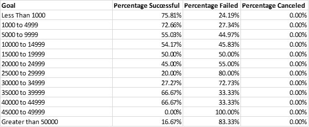
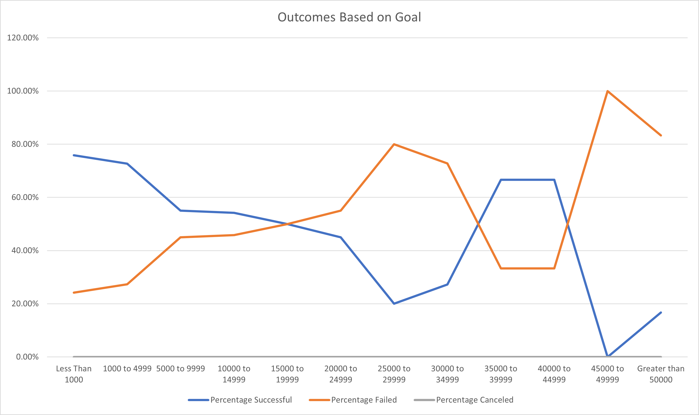
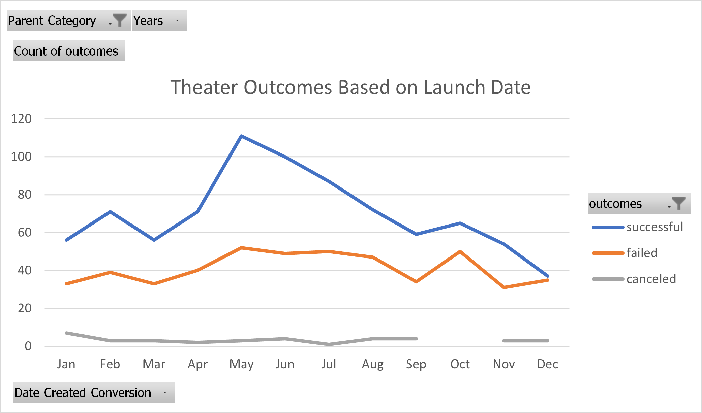

# An Analysis of Kickstarter Campaigns
Prepared for Louise, by David Martin on 10/4/20
---
## Overview of Project
---
Louise’s play, Fever came close to its fundraising goal in a short amount of time. Louise would like to know how different campaigns fared in relation to their launch dates and their funding goals.  This project will evaluate all Crowdfunding projects from years 2010 through 2017 in the United States, focusing on Theater as a category and Plays as a subcategory.  It will provide trend analysis and make recommendations to Louise about most successful goals and timelines to launch a funding campaign based on the historical data.
---
## Technology Involved
This project leverages Excel to evaluate a large data set and summarize that data set by creating pivot tables and pivot charts.  The large data set is filtered with conditional formatting applied.  New columns and tables are populated by utilizing the vlookup function to populate cells in the subsequent table or column based on values or conditional arguments in the former table or column.  Summary columns utilizing excel functions and nested functions to convert or summarize data are included as follows:
---
  * Round(), to present the quotient of two numeric columns to achieve a percentage as a whole number.
  * IfError(), to evaluate each cell in a column and if condition not met, place a suitable value in the cell
  * Convert Text to Columns Wizard, to evaluate a column that has multiple delimited data elements within one column and convert those into their own respective column.
  * Unix timestamp conversion to date formulas
  * Average(), to find the Mean of a column
  * Meadian(), to find the Median of a column
  * CountIFS(), to populate columns with a number count based on conditionals or criteria
  * Sum(), to auto sum a column or range
---
## Analysis and Challenges
---
The fund-raising campaign for Fever started on June 13, 2016 and ended on July 11, 2016.  This campaign had a goal of raising $2,885 to fund the production of the play, but fell short of the goal with actual donations totaling $2,485.  There were 10 backers who gave an average donation of $248.50.  Louise has indicated that a minimum of $4000 is needed to fund her play.
---
The challenge will be to analyze the available data and determine any factors Louise can use to plan her new funding campaign by looking at successful campaigns that met the pledge goals.  Challenges do exist with the data.  For example, the data in years 2010-2013 have very few funding campaigns included.  There are fewer than 11 campaigns per year, respectively with 11 being the highest in 2013.  From 2014-2016, there sufficient sample sizes to draw some inferences.  2017 again lags with only 48 total programs.  We will use the entire data set from 2010 through 2017 and draw the best inferences possible from the available data.
---
To begin, we will look at the data summarized from two perpectives:
---
* Outcomes based on Campaign Goal Size
* Outcomes based on Launch Date Timing

### Campaign Goal Analysis
---
#### Table 1 - Campaigns by Size, Qty and Outcome 
---

---
#### Table 2 - Campaigns by Size and Outcome Percentage 
---

---
---
Based on the above summary data, campaigns in the range of $1000 to $5000 were highly successful at 72.6%.  Also, since this is the indicated size campaign desired, there are 388 examples to draw from to provide insight into the needed campaign for Louise.
---
#### Image 1 Outcomes vs Goals 
---
---
The above image confirms successful campaigns from under $5000, but the data indicates a decreasing success rate with campaigns with goals between $5,000 and $15,000 and campaigns from $15,000 to $35,000 resulted in more unsuccessful campaigns than successful.  This trend changes with another sweet spot being realized for campaigns sized between $35,000 and $45,000.  Campaigns over 45,000 again grow rapidly in their frequency of unsuccess.
---
### Launch Date Analysis
---
The following data tells the story of timing for successful fund-raising campaigns.
---
#### Image 2 Outcomes by Date 
---
According to the data, successful funding campaigns that start between April and August have the highest frequency of success.  
## Results
---
Two conclusions drawn about the Theater Outcomes based on Launch Date?
---
1. Campaign should start between April and August.
2. The two months with highest success rates are May and June with total successes at 111 and 100, respectively. 
---
Conclusion about the Outcomes based on Goals?
---
1.  The success rate for campaigns based on Louise's goal of a $4,000 Campaign is in one of the highest success categories between $1,000 and $5,000 at 72.6%.
2.  A second sweet spot for successful campaigns exist between $35,000 and $45,000.
---
What are some limitations of this dataset?
---
The data set does not include information that might help Louise know what actions were taken to secure the funding for the campaign.  Data that could include communication methods, presentation materials, venues would help Louis with this outcome data and timing data would help Louise know with more certainty what to do to better ensure her campaign's success.
---
This data set is filtered for US campaigns only.  Additional subsets of data based on country might help Louise decide if she'd like to have multiple iterations of her campagin in different countries.
---
What are some other possible tables and/or graphs that we could create?
---
There are additional tables and graphs that could be created.  Similar charts and graphs based on subsets of data filtered by country would be useful to determine if a broader campaign would be productive.  Similarly, tables and graphs that might show a correlation between the number of backers and successful campaigns could assist with types of communication plans.  Lastly, graphs and tables that demonstrate at what time of the year produces highest donations could be useful as well.
---

